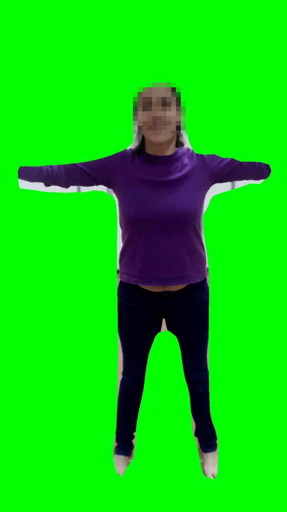
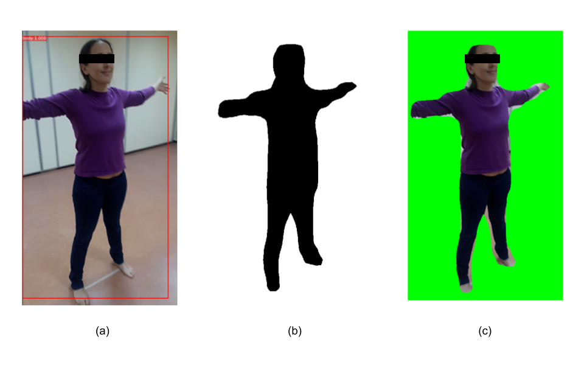
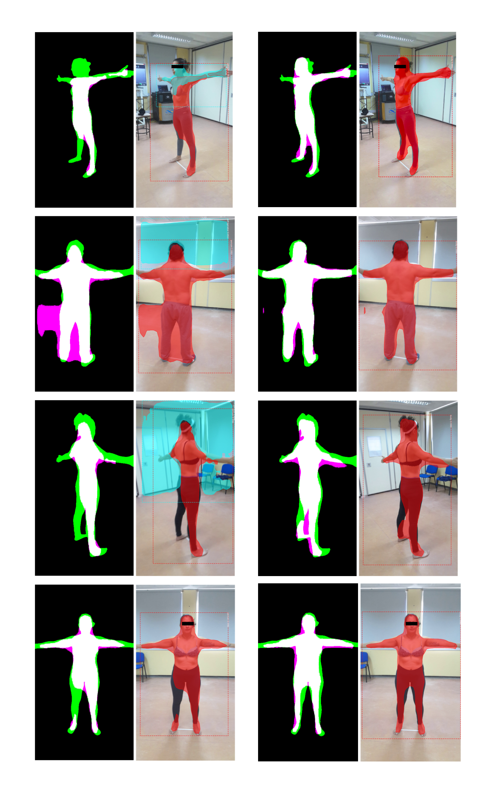
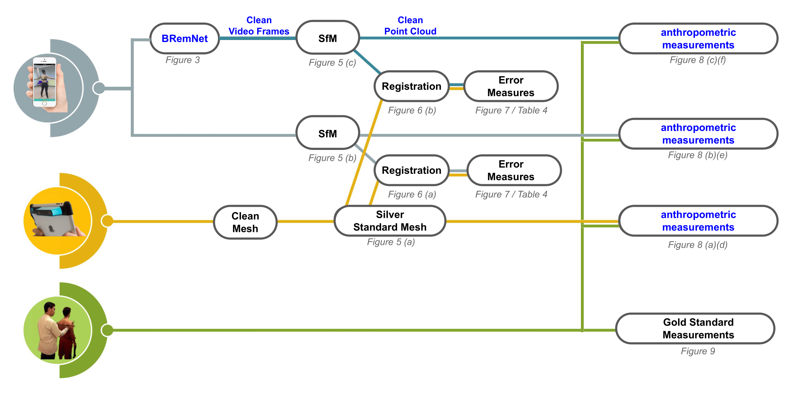

# BRemNet
BRemNet (Background Removal Network) | [*body2vec*](https://doi.org/10.3390/jimaging6090094) (2020)

We developed BRemNet, a further refinement of [Mask R-CNN](https://github.com/matterport/Mask_RCNN) with the aim of pre-processing per frame the videos taken specifically for photogrammetric 3D body reconstruction. As with Mask R-CNN, we use an RPN, but we add a binary classifier, and a background removal and chroma coding step. The RPN generates a set of bounding boxes which may contain the human body within the video frame. These boxes are refined using the Mask R-CNN regression model. The binary classifier was trained to label pixels as foreground/background using the pre-trained weights of the Microsoft Common Objects in COntext (MS COCO) containing the labeled person. We prepared a training dataset with 200 frames with different bodies in different frame locations. These frames were manually annotated using the VGG Image Annotator. The result of this step is then a binary mask containing the silhouette of the human body present in the frame. The mask is used in the final background removal and chroma coding step. After this processing, the video takes are converted to a set of about 500 frames in which the foreground (the human body) remained unchanged and the background was set into green, which reduces the error introduced in the subsequent SfM step.

| Result | Intermediate |
| --- | --- |
|  |  |

Segmentation examples: Mask R-CNN (left) and BRemNet (right). The segmented mask is superimposed in red to the actual frames. In Mask R-CNN, masks of other identified objects are superimposed in cyan. In masks, true positives are in white, false positives are in magenta, and false negatives are in green.



## Installation
### Prerequisites
Dependencies
```
pip3 install -r requirements.txt
```
### Install
Clone this repository
```
git clone https://github.com/aletrujim/BRemNet.git BRemNet
```
Download `humanbody.h5`

### Use
To train
```
python3 bremnet_segmentation.py train --dataset=datasets/body --weights=humanbody.h5
```
To test video segmentation
```
python3 bremnet_segmentation.py segmentation --weights=humanbody.h5 --video=videos/001.mp4
```

## Workflow


## Citation
If you use this data or the *BRemNet* model in your research, please cite this project.
```
@article{trujillo2020body2vec,
  title={body2vec: 3D Point Cloud Reconstruction for Precise Anthropometry with Handheld Devices},
  author={Trujillo-Jim{\'e}nez, Magda Alexandra and Navarro, Pablo and Pazos, Bruno and Morales, Leonardo and Ramallo, Virginia and Paschetta, Carolina and De Azevedo, Soledad and Ruderman, Anah{\'\i} and P{\'e}rez, Orlando and Delrieux, Claudio and others},
  journal={Journal of Imaging},
  volume={6},
  number={9},
  pages={94},
  year={2020},
  publisher={Multidisciplinary Digital Publishing Institute}
}
